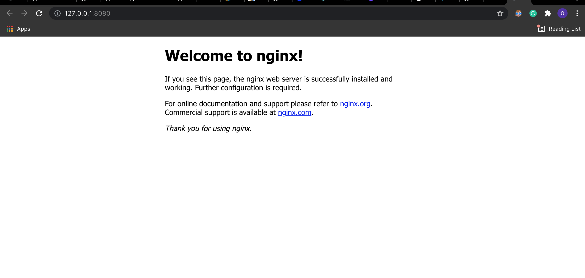

### Building a Chart

Charts are the packages Helm works with. 
At the heart of charts are templates to generate Kubernetes manifests that can be installed and managed in a cluster.
A good starting point to showcase the parts of a chart and we build a basic stateless service like nginx.

```shell
helm create flaskapp
```

Output:
📦flaskapp
 ┣ 📂charts
 ┣ 📂templates
 ┃ ┣ 📂tests
 ┃ ┃ ┗ 📜test-connection.yaml
 ┃ ┣ 📜NOTES.txt
 ┃ ┣ 📜_helpers.tpl
 ┃ ┣ 📜deployment.yaml
 ┃ ┣ 📜hpa.yaml
 ┃ ┣ 📜ingress.yaml
 ┃ ┣ 📜service.yaml
 ┃ ┗ 📜serviceaccount.yaml
 ┣ 📜.helmignore
 ┣ 📜Chart.yaml
 ┗ 📜values.yaml


- The Chart.yaml file contains metadata and some functionality controls for the chart.
- Templates used to generate Kubernetes manifests are stored in the templates directory.
- The NOTES.txt file is a special template. When a chart is installed, the NOTES.txt template is rendered and displayed rather than being installed into a cluster.
- Default values passed to the templates when Helm is rendering the
manifests are in the values.yaml file. When you instantiate a chart, these values can be overridden.

You can install this newly created chart without any modifications by running the following command:

```shell
helm install cookingapp flaskapp
```
Output :
```shell
NAME: cookingapp
LAST DEPLOYED: Sun Oct 17 12:30:52 2021
NAMESPACE: default
STATUS: deployed
REVISION: 1
NOTES:
1. Get the application URL by running these commands:
  export POD_NAME=$(kubectl get pods --namespace default -l "app.kubernetes.io/name=flaskapp,app.kubernetes.io/instance=cookingapp" -o jsonpath="{.items[0].metadata.name}")
  export CONTAINER_PORT=$(kubectl get pod --namespace default $POD_NAME -o jsonpath="{.spec.containers[0].ports[0].containerPort}")
  echo "Visit http://127.0.0.1:8080 to use your application"
  kubectl --namespace default port-forward $POD_NAME 8080:$CONTAINER_PORT
```

Output:
Open http://127.0.0.1:8080  on your browser



Our current chart is configured to use a ClusterIP

The methods to expose the application are tied to built-in Kubernetes resource types rather than features of the application. That makes them portable to your custom applications. The methods to expose applications
include:
`ClusterIP`
A configuration option on the Kubernetes Service resource type that
exposes the service on a cluster-level internal IP address.
`NodePort`
An alternative option for Kubernetes Service resources that exposes
the service on a static port of each node. A ClusterIP is automatically created as well.
`LoadBalancer`
A Kubernetes Service configuration option that exposes an
application externally using a load balancer provided by the hosting
provider.
`Ingress`
Ingress resources are additional resources to Services that expose a
service over HTTP and HTTPS. An Ingress Controller, such as ingressnginx, is required for this to work.

#### Delete the app instance from your k8s cluster

```
helm delete cookingapp
```
Output:
```shell
release "cookingapp" uninstalled
```

### Scaffolding our flaskapp

1. Update the `Chart.yaml` and add the following below

```yaml
apiVersion: v2
name: flaskapp
description: A chart for simple flask apps
version: 0.1.0
appVersion: "1.16.0"
keywords:
 - flaskapp
home: https://oluchiorji.com/
sources:
 - https://github.com/oluchilinda/Learning-Helm-K8s/flaskapp
maintainers:
 - name:Oluchi
 email: oluchiorji@example.com
 - name: Oluchi orji
 email: oluchiorji@example.com
```

Helm is written in the Go programming language, and Go includes template packages.

EXAMPLE
`product: {{ .Values.product | default "rocket" | quote }}`
1. In this YAML file there is a key name of product.
1. The value is generated using a template. {{ and }} are the opening and closing brackets to enter and exit template logic
1. There are three parts to the template logic separated by a `|`. This is called a pipeline, and it works the same way as a pipeline in Unix-based systems. 
1. `Values.product.` This comes from the data object passed in when the templates are rendered.
 If the value passed in is empty, the default function uses the default value of
`"rocket"`, ensuring there is a value. 
1. This is then sent to the quote function, which ensures the string is wrapped in quotes before writing it to
the template.

### Deployments
```yaml
apiVersion: apps/v1
kind: Deployment
metadata:
 name: {{ include "flaskapp.fullname" . }}
 labels:
 {{- include "flaskapp.labels" . | nindent 4 }}

```
The `include` template function enables including the output of one
template in another template, and this works in pipelines. The first
argument to the `include` function is the name of the template to use. 

`flaskapp.fullname` and `flaskapp.labels` are two reusable templates included in the  chart via the `_helpers.tpl` file.

```yaml
pec:
  {{- if not .Values.autoscaling.enabled }}
  replicas: {{ .Values.replicaCount }}
  {{- end }}
  selector:
    matchLabels:
      {{- include "flaskapp.selectorLabels" . | nindent 6 }}
  template:
    metadata:
      {{- with .Values.podAnnotations }}
      annotations:
        {{- toYaml . | nindent 8 }}
      {{- end }}
      labels:
        {{- include "flaskapp.selectorLabels" . | nindent 8 }}
    spec:
      {{- with .Values.imagePullSecrets }}
      imagePullSecrets:
        {{- toYaml . | nindent 8 }}
      {{- end }}
      serviceAccountName: {{ include "flaskapp.serviceAccountName" . }}
      securityContext:
        {{- toYaml .Values.podSecurityContext | nindent 8 }}
      containers:
        - name: {{ .Chart.Name }}
          securityContext:
            {{- toYaml .Values.securityContext | nindent 12 }}
          image: "{{ .Values.image.repository }}:{{ .Values.image.tag | default .Chart.AppVersion }}"
          imagePullPolicy: {{ .Values.image.pullPolicy }}
          ports:
            - name: http
              containerPort: 80
              protocol: TCP
          livenessProbe:
            httpGet:
              path: /
              port: http
          readinessProbe:
            httpGet:
              path: /
              port: http
          resources:
            {{- toYaml .Values.resources | nindent 12 }}
      {{- with .Values.nodeSelector }}
      nodeSelector:
        {{- toYaml . | nindent 8 }}
      {{- end }}
      {{- with .Values.affinity }}
      affinity:
        {{- toYaml . | nindent 8 }}
      {{- end }}
      {{- with .Values.tolerations }}
      tolerations:
        {{- toYaml . | nindent 8 }}
      {{- end }}

```


The properties on `.Values` are computed based on a number of factors.
The default values and starting point are based on the values provided by
the values.yaml file in the chart.

These values can be overridden by values passed in when the chart
is instantiated. The helm CLI has flags to pass in values directly (i.e., `--set`, `--set-file`, and `--set-string`) 

### Updating the values.yaml file
I will update the file and container images url
```yaml
replicaCount: 1

image:
  repository: oluchilinda/flask-setup:latest
  pullPolicy: IfNotPresent
  # Overrides the image tag whose default is the chart appVersion.
  tag: ""

```

### Exposing Services
From the `values.yaml` file
```yaml
service:
  type: ClusterIP
  port: 80

ingress:
  enabled: false
  className: ""
  annotations: {}
    # kubernetes.io/ingress.class: nginx
    # kubernetes.io/tls-acme: "true"
  hosts:
    - host: chart-example.local
      paths:
        - path: /
          pathType: ImplementationSpecific
  tls: []
  #  - secretName: chart-example-tls
  ```

In Kubernetes there are two built-in objects you can use to expose
applications. 
The first is a Service. The service property will let you
select the type of Service being used. While ClusterIP is used by
default, other options such as NodePort and LoadBalancer can be
used. The few lines of YAML in the service section are paired with the
generated `service.yaml` template to create a full Service manifest to upload
to Kubernetes.

The second built-in object is the Ingress manifest, which can be paired
with a Service, and the chart has the capability to generate them.
Ingress configuration provides a means to show off a common pattern
found in charts: the use of an `enabled` property to turn features on and
off. In this case ingress.`enabled` is set to false. 
When Helm renders the templates and sees a value of false, the Ingress manifest is skipped.
This is due to the use of an if logic statement in the Ingress template
found in the generated `ingress.yaml `file


##### Resource Limits
When you run applications in production, it is a good practice to set
resource limits. This prevents, for example, a memory leak in one container
from disrupting other containers.
 When a chart author creates a chart that others are going to use, they may not know where it will be installed and
how many resources will be available there. Could this be installed on a
laptop by a developer or someone testing out the chart? Or, might this be
installed on large production servers? To handle this variance in
environment, the recommendation is to put in resource limits and then turn
them into comments. This can be found in the next section of the values.yaml file:


```yaml

resources: {}
  # We usually recommend not to specify default resources and to leave this as a conscious
  # choice for the user. This also increases chances charts run on environments with little
  # resources, such as Minikube. If you do want to specify resources, uncomment the following
  # lines, adjust them as necessary, and remove the curly braces after 'resources:'.
  limits:
    cpu: 100m
    memory: 128Mi
  requests:
    cpu: 100m
    memory: 128Mi

```

#### To package your helm apps
```shell
helm package flaskapp
```

There are some useful flags you can use when packaging a chart:
`--dependency-update` (-u)
Tells Helm to update the dependent charts prior to creating the archive.
This will update the Chart.lock file and place a copy of the dependent
charts in the chart directory. 
`--destination` (-d)
Enables you to set the location to put the chart archive if it is different
from the current working directory.
`--app-version`
Can be used to set the appVersion property of the Chart.yaml file.
This is especially useful if you create new releases of the chart for each
new release of your application running within the container and there is
no other change to the chart. Automation can use a flag like this as part
of the process to build the new version.
`--version`
Updates the chart’s version. This is useful if you’re updating the
appVersion using the command line as part of the process to
package a chart.

##### Linting a Chart
```shell
helm lint flaskapp
```